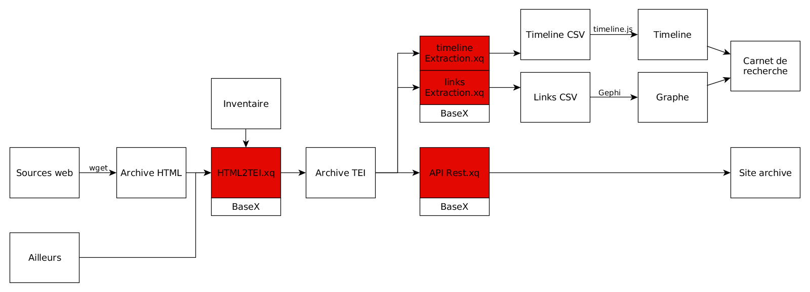

## Éditorialisation et littérature: le cas du Général Instin
&nbsp;

Enrico Agostini-Marchese, Servanne Monjour, Nicolas Sauret, Marcello Vitali-Rosati

 <!-- .element: class="logo" -->

CSDH-SCHN 2017 - Congress 2017 @ Toronto
<small>  
29-31 mai 2017</small>

%%%%%%%%%%%%%%%%%%%%%%%%%%%%%%%%%%%%%%%%%%%%%
<!-- .slide: data-background-image="img/cropped-instin_climax_00.jpg" -->
<!-- .slide: class="hover"-->

### Sommaire

* Problématique générale
* Le cas Instin
* Questions de recherche :
  1. Question littéraire
  2. Question dispositive
  3. Question ontologique
* Conclusion

===

On peut écrire des notes ici.

%%%%%%%%%%%%%%%%%%%%%%%%%%%%%%%%%%%%%%%%%%%%%
<!-- .slide: data-background-image="img/cropped-instin_climax_00.jpg" -->
<!-- .slide: class="hover"-->

### Test

Coucou !

* Problématique générale
* Le cas Instin
* Questions de recherche :

> CItation !!

%%%%%%%%%%%%%%%%%%%%%%%%%%%%%%%%%%%%%%%%%%%%%

<!-- .slide: data-background-image="img/espace.jpg" -->
<!-- .slide: class="hover"-->

## Problématique générale

* Qu'est-ce que l'écriture à l'époque du numérique
  * écriture et espace
  * écriture et littérature
* Comment se transforment la production, la circulation et la légitimation des contenus?

===
Marcello:
Questions de recherche de la Chaire : qu'est-ce que la litt à l'époque du numérique ?
Comment changent les dispositifs d'écriture (production/ circulation / légitimation)

%%%%%%%%%%%%%%%%%%%%%%%%%%%%%%%%%%%%%%%%%%%%%
## Le cas Instin

§§§§§§§§§§§§§§§§§§§§§§§§§§§§§§§§§§§§§§§§§§§§§
<!-- .slide: data-background-image="img/instinss.jpg" -->

### Qu'est-ce qu'Instin ?

===

Notes de présentation

§§§§§§§§§§§§§§§§§§§§§§§§§§§§§§§§§§§§§§§§§§§§§
<!-- .slide: data-background-image="img/item-026.png" data-background-size="contain" -->

<!--  -->

source image : remue.net/  <!-- .element: class="source" -->
===

Notes de présentation

§§§§§§§§§§§§§§§§§§§§§§§§§§§§§§§§§§§§§§§§§§§§§
<!-- .slide: data-background-image="img/item-036.png" data-background-size="contain" -->

source image : generalinstin.net/  <!-- .element: class="source" -->

===

Notes de présentation

§§§§§§§§§§§§§§§§§§§§§§§§§§§§§§§§§§§§§§§§§§§§§
<!-- .slide: data-background-image="img/toutesLesImages.png" -->

===

Notes de présentation

§§§§§§§§§§§§§§§§§§§§§§§§§§§§§§§§§§§§§§§§§§§§§
<!-- .slide: data-background-image="img/Hinstin-famille.jpg" -->

source image : BNF  <!-- .element: class="source" -->

===

Notes de présentation

§§§§§§§§§§§§§§§§§§§§§§§§§§§§§§§§§§§§§§§§§§§§§
<!-- .slide: data-background-image="img/sp38.png" -->

### Méthodologie

1.  Recherche et collecte du corpus
2.  Chaine d'archivage et d'édition
3.  Exploration des données
4.  Réflexion épistémologique sur le projet

===

Notes de présentation

%%%%%%%%%%%%%%%%%%%%%%%%%%%%%%%%%%%%%%%%%%%%%
## Axes de recherche

1. Question littéraire
2. Question dispositive
3. Question ontologique

%%%%%%%%%%%%%%%%%%%%%%%%%%%%%%%%%%%%%%%%%%%%%
## Question littéraire

§§§§§§§§§§§§§§§§§§§§§§§§§§§§§§§§§§§§§§§§§§§§§
### Littérature Brouhaha

> « Publier » retourne à son sens originel : rendre public, passer de l’expression privée destinée à des correspondants précis à l’expression pour des publics de plus en plus divers.
>
> [C]ette multitude d’espaces publics caractérise le moment contemporain de la littérature, comme la sphère publique de la Littérature caractérisait sa représentation moderne. Si ces espaces publics ont toujours existé, même lorsqu’on les mettait sous silence, jamais ils n’ont été aussi nombreux et visibles […] si bien que le littéraire aujourd’hui apparaît en très grande partie comme une arène conflictuelle composée d’une sphère publique hégémonique reposant sur l’imprimé et d’une multitude d’espaces publics contre-hégémoniques relevant plutôt d’une « littérature-brouhaha » (exposée, performée, in situ, multi-support) avec de très nombreuses circulations entre eux. »
>
> Lionel Ruffel, _Brouhaha, Les Mondes du contemporain_

<!-- .element: style="font-size:1.4rem; text-align:justify" -->

===

Notes de présentation

§§§§§§§§§§§§§§§§§§§§§§§§§§§§§§§§§§§§§§§§§§§§§
<!-- .slide: data-background-image="img/sp38.png" -->

### Gestes de publication

===

- un nouveau mode de publication littéraire ("Gestes de publication")
- institution litt ? (Oeuvre)
+ slides Joelle Z. sur l'espace public ?

forme anthologique

§§§§§§§§§§§§§§§§§§§§§§§§§§§§§§§§§§§§§§§§§§§§§
<!-- .slide: data-background-video="/home/nicolas/Vidéos/RueInstin-leFilm_big.mp4" -->

### Oralité, le retour

source: https://vimeo.com/138619730

<!-- .element: class="source" -->

> citation Zumthor

===

oralité et performance
origine de la littérature : Epopée, poésie médievale
poiesis (le _faire_), poésie et poème

§§§§§§§§§§§§§§§§§§§§§§§§§§§§§§§§§§§§§§§§§§§§§
### GI est-il :

* un objet intermédial ?
* un objet ?
* un milieu ?
* un vecteur ?
* un média ?

===

* collecte et inventaire des "manifestations" :
* observations : expérience médiatique (formes d'expressions médiatiques - reliées à la question de la publication), identité visuelle,
* question : est ce qu'il y a des patterns textuels et patterns visuels qui se répondent (voir blog)
* et finalement, intervient la question de l'intermédialité :
  * à la fois comme littérature multi-modales
  * et comme intersections d'idées, d'acteurs, d'initiatives : considérer les formes d’existence à partir des relations

* et finalement : emergence d'une question : est-ce que gi est un média ?

---
- l'intermédialité : formes d'expressions médiatiques ; intersections d’idées, d’acteurs, d’initiatives, dont Instin se pose en vecteur davantage qu’en œuvre ; considérer les formes d’existence à partir des relations

média - milieu

**Débat entre nous quatre**

%%%%%%%%%%%%%%%%%%%%%%%%%%%%%%%%%%%%%%%%%%%%%
<!-- .slide: data-background-image="./img/mashupInstin.png" -->

## Question dispositive

§§§§§§§§§§§§§§§§§§§§§§§§§§§§§§§§§§§§§§§§§§§§§
<!-- .slide: data-background-image="./img/vitrailOriginal.png" -->

### Dispositif GI ?

===

* intuition initiale : cas d'étude idéal pour l'environnement-dispositif
* poser la question du dispositif : nous éclairer sur la nature d'un environnement-dispositif : appropriation et réécriture
* absence de dispositif ?
  * oui, mais en fait non.

*

§§§§§§§§§§§§§§§§§§§§§§§§§§§§§§§§§§§§§§§§§§§§§
<!-- .slide: data-background-image="./img/Composition3Graphes.png" data-background-size="contain" -->

### _dispositive_

§§§§§§§§§§§§§§§§§§§§§§§§§§§§§§§§§§§§§§§§§§§§§
<!-- .slide: data-background-image="img/20170509_3_remue1524.png" -->

### Milieu

§§§§§§§§§§§§§§§§§§§§§§§§§§§§§§§§§§§§§§§§§§§§§
### GI, un rhizome ?

===

pour lancer Enrico

§§§§§§§§§§§§§§§§§§§§§§§§§§§§§§§§§§§§§§§§§§§§§
### Machine de guerre

===

Enrico est lancé
Enrico lance Marcello sur l'éditorialisation

§§§§§§§§§§§§§§§§§§§§§§§§§§§§§§§§§§§§§§§§§§§§§
## La notion d'éditorialisation

* 2004-2007: apparition du mot
  * Une sorte d'édition dans l'environnement numérique
  * Bachimont : passage d'un document non-numérique à un document numérique

* 2008: le terme s'institutionnalise
  * Sens public: formes de production et de circulation de la connaissance en environnement numérique
  * Laboratoire MSH: Pratiques interdisciplinaires et circulation du savoir : vers une éditorialisation des SHS (Wormser, Vitali-Rosati)

===
(marcello est lancé)
éditorialisation: penser un processus ouvert où auteurs, collectivités, plateformes, dynamiques pratiques sont mêlées et difficiles à retracer. pas curation, pas édition... éditorialisation
poutant ça produit une émergence de sens

§§§§§§§§§§§§§§§§§§§§§§§§§§§§§§§§§§§§§§§§§§§§§
## La notion d'éditorialisation

>L'éditorialisation désigne l'ensemble des dynamiques qui produisent et structurent l'espace numérique. Ces dynamiques sont les interactions des actions individuelles et collectives avec un environnement numérique particulier.

Vitali-Rosati, Qu'est-ce que l'éditorialisation?, Sens public 2016

===

§§§§§§§§§§§§§§§§§§§§§§§§§§§§§§§§§§§§§§§§§§§§§
## Caractéristiques de l'éditorialisation

- ouverte
  - plusieurs plateformes
  - plusieurs acteurs
  - toujours inachevée
- processuelle
- collective

===
(différence avec la curation de contenus)

§§§§§§§§§§§§§§§§§§§§§§§§§§§§§§§§§§§§§§§§§§§§§
## L'espace

- Espace mathématique et espace social
- L'espace porte des valeurs - le nomos de Schmitt (cf. Agostini-Marchese)

===

On a dit que l'édito produit l'espace: mais qu'est-ce que l'espace?

§§§§§§§§§§§§§§§§§§§§§§§§§§§§§§§§§§§§§§§§§§§§§
## Espace numérique

- un espace architectural
- un espace réel
- un espace hybride
- un espace en mouvement

§§§§§§§§§§§§§§§§§§§§§§§§§§§§§§§§§§§§§§§§§§§§§
## Espace et autorité

- espace et _nomos_

===

Enrico doit faire le lien vers la question ontologique

%%%%%%%%%%%%%%%%%%%%%%%%%%%%%%%%%%%%%%%%%%%%%
## Question ontologique

§§§§§§§§§§§§§§§§§§§§§§§§§§§§§§§§§§§§§§§§§§§§§

<iframe src='https://cdn.knightlab.com/libs/timeline3/latest/embed/index.html?source=18rhwdJjrIvOahi_L70BqDT9x8_EKqmxgsPQk7AFtnog&font=Default&lang=fr&initial_zoom=2&height=650' width='100%' height='650' webkitallowfullscreen mozallowfullscreen allowfullscreen frameborder='0'></iframe>

===

présentation de la timeline
timeline encore une tentative,
catégorisation : celles des sites..

objectifs : proposer d'autres catégorisations

mais aussi d'autres formes de visualisation

à partir de la Timeline, constat :
  * on a observé que les frontières* n'étaient pas si évidentes : frontières temporelles et spatiales de l'objet

§§§§§§§§§§§§§§§§§§§§§§§§§§§§§§§§§§§§§§§§§§§§§

### Origine(s)

===

frontières : quand GI commence ??
  la photo ? chatelier ? les premières manifestations littéraires sur **H**-instin, ou toute inscription du nom Hinstin : l'acte de naissance d'Hinstin , l'acte de décès (il produit le vitrail),
  voir à la BNF : un fond photographique dédié à la famille Hinstin (+ navire de guerre), en lien avec Lautréamont (alias Isidore Ducasse)

on ne répond pas à la question

§§§§§§§§§§§§§§§§§§§§§§§§§§§§§§§§§§§§§§§§§§§§§

### Spin-offs

===

des spins-offs (publications papier sous le nom d'Instin):
* Climax : réflexion sur l'archive
* Spoon River : côté anthologique qui revient

L'aspect anthologique

§§§§§§§§§§§§§§§§§§§§§§§§§§§§§§§§§§§§§§§§§§§§§

### Histoire et mémoire collective

===

confrontation entre l'objet littéraire et l'objet historique (l'histoire est de toutes les façons en construction, pas en opposition avec la fiction)

Chronologie linéaire :

du réel au récit : le point d'origine
  la photographie du vitrail VS la chronologie de "vrai" général

et comment l'un façonne l'autre.

§§§§§§§§§§§§§§§§§§§§§§§§§§§§§§§§§§§§§§§§§§§§§
### Pourquoi le GI ?

Qu'est ce qui a permis à GI de fonctionner ?

===

L'intuition qu'Instin est davantage qu'un terrain de jeu : il semble pouvoir révéler quelque chose de notre mémoire collective, de notre identité.
la question de l'histoire, de l'origine

La symbolique du général

les ingrédients du mème

§§§§§§§§§§§§§§§§§§§§§§§§§§§§§§§§§§§§§§§§§§§§§
### la question du mythe

===

(pour Servanne)
histoire ou récit ?

§§§§§§§§§§§§§§§§§§§§§§§§§§§§§§§§§§§§§§§§§§§§§

### Imaginaire/réel

===

Statut ontologique de la littérature
Espace
P. Valéry

%%%%%%%%%%%%%%%%%%%%%%%%%%%%%%%%%%%%%%%%%%%%%

## Archiver Instin

===

éditorialisation de l'archive et conséquence ontologique
totaliser Instin

%%%%%%%%%%%%%%%%%%%%%%%%%%%%%%%%%%%%%%%%%%%%%

### Merci !

<small>à suivre sur [nicolassauret.net/behindinstin](http://nicolassauret.net/behindinstin)</small>

<small> @servanneM ; @nicolasauret ; @monterosato ; @enrico </small>

 <!-- .element: class="logo" -->
