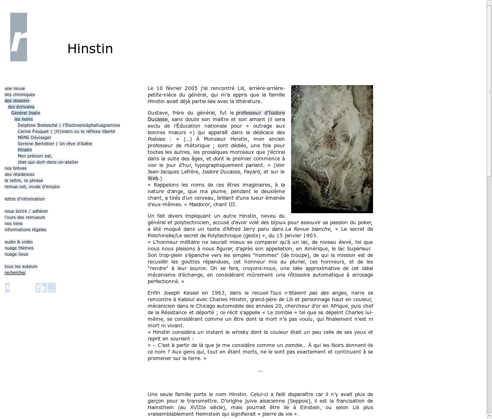
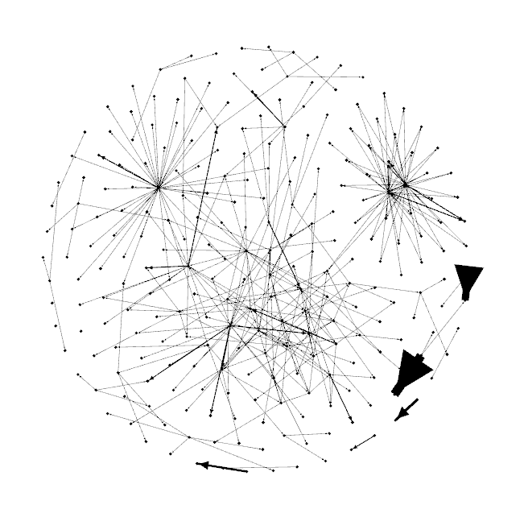
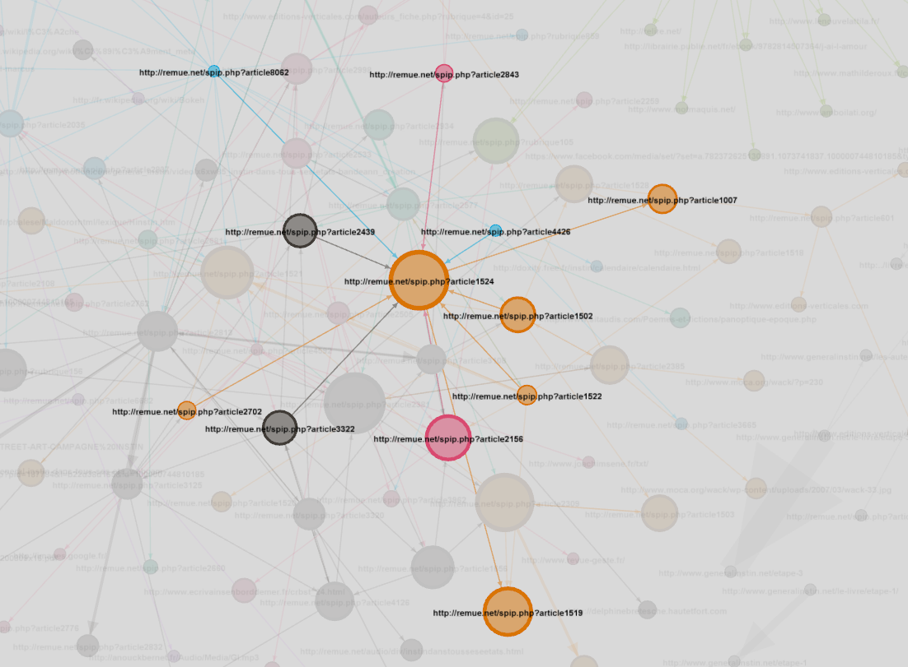
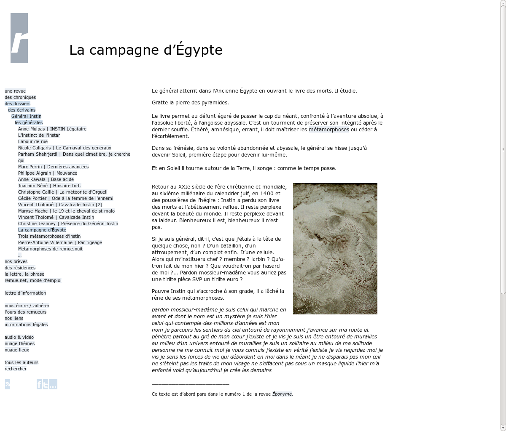
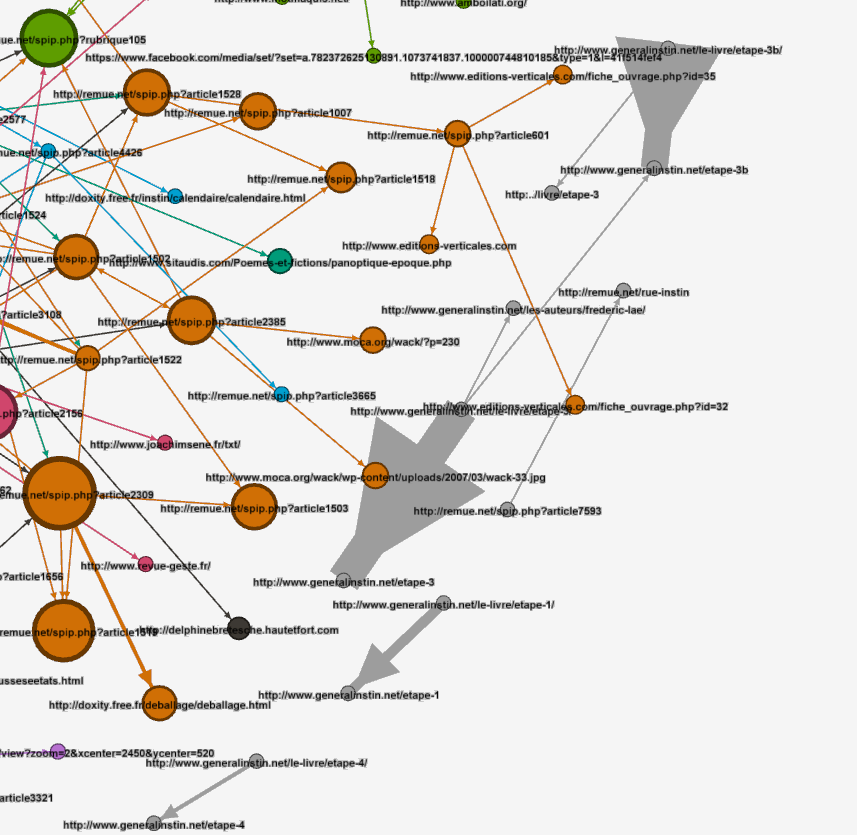

## Éditorialisation et littérature: le cas du Général Instin
&nbsp;

Enrico Agostini-Marchese, Servanne Monjour,  
Nicolas Sauret, Marcello Vitali-Rosati

 <!-- .element: class="logo" style="width:30%; background-color:ghostwhite;padding: 5px" -->

CSDH-SCHN 2017 - Congress 2017 @ Toronto  
29-31 mai 2017

<!-- .element: style="font-size:1.4rem" -->

 <!-- .element: class="logo" -->

%%%%%%%%%%%%%%%%%%%%%%%%%%%%%%%%%%%%%%%%%%%%%
<!-- .slide: data-background-image="img/cropped-instin_climax_00.jpg" -->
<!-- .slide: class="hover"-->

### Sommaire

* Problématique générale
* Le cas Instin
* Questions de recherche :
  1. Question littéraire
  2. Question dispositive
  3. Question ontologique
* Conclusion

===

On peut écrire des notes ici.

%%%%%%%%%%%%%%%%%%%%%%%%%%%%%%%%%%%%%%%%%%%%%

<!-- .slide: data-background-image="img/0-ordonnancement_rubrique_105vagues.jpg" data-background-size="contain"--->
<!-- .slide: class="hover"-->

## Problématique générale

* Qu'est-ce que l'écriture à l'époque du numérique
  * écriture et espace
  * écriture et littérature
* Comment se transforment la production, la circulation et la légitimation des contenus?

===
Marcello:
Questions de recherche de la Chaire : qu'est-ce que la litt à l'époque du numérique ?
Comment changent les dispositifs d'écriture (production/ circulation / légitimation)

%%%%%%%%%%%%%%%%%%%%%%%%%%%%%%%%%%%%%%%%%%%%%
<!-- .slide: data-background-image="img/generalinstinVitrail.jpg" -->

## Le cas Instin

§§§§§§§§§§§§§§§§§§§§§§§§§§§§§§§§§§§§§§§§§§§§§
<!-- .slide: data-background-image="img/instinss.jpg" -->

### Qu'est-ce qu'Instin ?

===

Notes de présentation

§§§§§§§§§§§§§§§§§§§§§§§§§§§§§§§§§§§§§§§§§§§§§
<!-- .slide: data-background-image="img/vitrailOriginal.jpg" data-background-size="contain"-->

source image : remue.net/  <!-- .element: class="source" -->
===

Notes de présentation

§§§§§§§§§§§§§§§§§§§§§§§§§§§§§§§§§§§§§§§§§§§§§
<!-- .slide: data-background-image="img/item-026.png" data-background-size="contain" -->

<!--  -->

source image : remue.net/  <!-- .element: class="source" -->
===

Notes de présentation

§§§§§§§§§§§§§§§§§§§§§§§§§§§§§§§§§§§§§§§§§§§§§
<!-- .slide: data-background-image="img/item-036.png" data-background-size="contain" -->

source image : generalinstin.net/  <!-- .element: class="source" -->

===

Notes de présentation

§§§§§§§§§§§§§§§§§§§§§§§§§§§§§§§§§§§§§§§§§§§§§
<!-- .slide: data-background-image="img/toutesLesImages.png" -->

===

Notes de présentation

§§§§§§§§§§§§§§§§§§§§§§§§§§§§§§§§§§§§§§§§§§§§§
<!-- .slide: data-background-image="img/Hinstin-famille.jpg" -->

source image : BNF  <!-- .element: class="source" -->

===

Notes de présentation

§§§§§§§§§§§§§§§§§§§§§§§§§§§§§§§§§§§§§§§§§§§§§
<!-- .slide: data-background-image="img/sp38.png" -->
<!-- .slide: class="hover"-->

### Méthodologie

1.  Recherche et collecte du corpus
2.  Chaîne d'archivage et d'édition
3.  Exploration des données
4.  Réflexion épistémologique sur le projet

===

Notes de présentation

§§§§§§§§§§§§§§§§§§§§§§§§§§§§§§§§§§§§§§§§§§§§§
<!-- .slide: data-background-image="img/inventaireAtom.png" -->
<!-- .slide: class="hover"-->

### _inventaire.xml_

* Captation + indexation :

  1. Exploration du corpus par propagation hypertextuelle
  2. Captation systématique (en cours)
  3. Ajout de sources antérieures à GI

Actuellement <i class="fa fa-arrow-right"></i> 74 _manifestations_ (dont 90% sources web)

===

§§§§§§§§§§§§§§§§§§§§§§§§§§§§§§§§§§§§§§§§§§§§§
<!-- .slide: data-background-image="img/data-workflow.png" data-background-size="contain" -->

===

on retrouve l'inventaire, les sources et la captation web des sources,
un script vient encoder ces sources en TEI.

choix de la TEI : une approche initialement centrée sur le texte, même si on se rend compte progressivement à quel point les médias sont essentiels dans le paysage que dessine le corpus.

Par ailleurs, le passage d'un format HTML à un autre format fait sens dans cette démarche de production d'une archive, nécessité de distinguer les deux objets, que l'un ne soit pas simplement une copie de l'autre. Et nous reviendrons sur les effets et les refléxions que cette démarche a pu amener en dernière partie.

Le choix reste pertinent dans tous les cas, car la TEI nous donne toute latitude pour intégrer dans chacun des éléments les métadonnées d'archive dont nous avons besoin.

%%%%%%%%%%%%%%%%%%%%%%%%%%%%%%%%%%%%%%%%%%%%%
<!-- .slide: data-background-image="img/oeil.jpg" data-background-size="contain" -->
<!-- .slide: class="hover"-->

## Axes de recherche

1. Question littéraire
2. Question dispositive
3. Question ontologique

%%%%%%%%%%%%%%%%%%%%%%%%%%%%%%%%%%%%%%%%%%%%%
<!-- .slide: data-background-image="img/00-schema1-01floucinetique-2.jpg" data-background-size="contain" -->

## Question littéraire

§§§§§§§§§§§§§§§§§§§§§§§§§§§§§§§§§§§§§§§§§§§§§

> « Publier » retourne à son sens originel : rendre public, passer de l’expression privée destinée à des correspondants précis à l’expression pour des publics de plus en plus divers.
>
> [C]ette multitude d’espaces publics caractérise le moment contemporain de la littérature, comme la sphère publique de la Littérature caractérisait sa représentation moderne. Si ces espaces publics ont toujours existé, même lorsqu’on les mettait sous silence, jamais ils n’ont été aussi nombreux et visibles […] si bien que le littéraire aujourd’hui apparaît en très grande partie comme une arène conflictuelle composée d’une sphère publique hégémonique reposant sur l’imprimé et d’une multitude d’espaces publics contre-hégémoniques relevant plutôt d’une « littérature-brouhaha » (exposée, performée, in situ, multi-support) avec de très nombreuses circulations entre eux. »
>
> Lionel Ruffel, _Brouhaha, Les Mondes du contemporain_

<!-- .element: style="font-size:1.4rem; text-align:justify" -->

===

Notes de présentation

§§§§§§§§§§§§§§§§§§§§§§§§§§§§§§§§§§§§§§§§§§§§§
<!-- .slide: data-background-image="img/sp38.png" -->

### Gestes de publication

===

- un nouveau mode de publication littéraire ("Gestes de publication")
- institution litt ? (Oeuvre)
+ slides Joelle Z. sur l'espace public ?

forme anthologique

§§§§§§§§§§§§§§§§§§§§§§§§§§§§§§§§§§§§§§§§§§§§§
<!-- .slide: data-background-video="/home/nicolas/Vidéos/extrait-instin.mp4" -->

### Oralité, le retour

source: https://vimeo.com/138619730

<!-- .element: class="source" -->

> citation Zumthor

===

video : 9min + 11min30

oralité et performance
origine de la littérature : Epopée, poésie médievale
poiesis (le _faire_), poésie et poème

§§§§§§§§§§§§§§§§§§§§§§§§§§§§§§§§§§§§§§§§§§§§§
<!-- .slide: data-background-image="img/iLoveInstin.jpg" data-background-size="contain" -->
<!-- .slide: class="hover"-->

### GI est-il :

* un objet intermédial ?
* un objet ?
* un milieu ?
* un vecteur ?
* un média ?

===

* collecte et inventaire des "manifestations" :
* observations : expérience médiatique (formes d'expressions médiatiques - reliées à la question de la publication), identité visuelle,
* question : est ce qu'il y a des patterns textuels et patterns visuels qui se répondent (voir blog)
* et finalement, intervient la question de l'intermédialité :
  * à la fois comme littérature multi-modales
  * et comme intersections d'idées, d'acteurs, d'initiatives : considérer les formes d’existence à partir des relations

* et finalement : emergence d'une question : est-ce que gi est un média ?

---
- l'intermédialité : formes d'expressions médiatiques ; intersections d’idées, d’acteurs, d’initiatives, dont Instin se pose en vecteur davantage qu’en œuvre ; considérer les formes d’existence à partir des relations

média - milieu

**Débat entre nous quatre**

%%%%%%%%%%%%%%%%%%%%%%%%%%%%%%%%%%%%%%%%%%%%%
<!-- .slide: data-background-image="./img/mashupInstin.png" -->

## Question dispositive

===

Le cas Instin est particulièrement intéressant pour essayer de comprendre ce que devient le dispositif dans l'environnement numérique.

La notion de dispositif a toujours été problématique, elle fait parti de ces termes indéfinissables, insaisissables que tout le monde manipule malgré tout (et je pense avec raison).

§§§§§§§§§§§§§§§§§§§§§§§§§§§§§§§§§§§§§§§§§§§§§

Pour Foucault :

>  «Ce que j'essaie de repérer sous ce nom c'est, [...] un ensemble résolument hétérogène comportant des discours, des institutions, des aménagements architecturaux, des décisions réglementaires, des lois, des mesures administratives, des énoncés scientifiques, des propositions philosophiques, morales, philanthropiques ; bref, du dit aussi bien que du non-dit, voilà les éléments du dispositif.
>
> Le dispositif lui-même c'est le réseau qu'on établit entre ces éléments [...].
>
> C'est ça le dispositif : des stratégies de rapports de force supportant des types de savoir, et supportés par eux»
>
> Foucault, _Dits et écrits_, volume III, p.299 _sq_ (1977)

<!-- .element: style="font-size:1.4rem; text-align:justify" -->

===
Pour Foucault, c'est "un ensemble hétérogène", un "réseau", une "stratégie de rapport de force".

§§§§§§§§§§§§§§§§§§§§§§§§§§§§§§§§§§§§§§§§§§§§§

Pour Agemben :

> «Tout ce qui a, d'une manière ou d'une autre, la capacité de capturer, d'orienter, de déterminer, d'intercepter, de modeler, de contrôler et d'assurer les gestes, les conduites, les opinions et les discours des êtres vivants.»

<!-- .element: style="font-size:1.4rem; text-align:justify" -->

===
Agamben fait une Partition générale et massive de l'être entre :

1. les êtres vivants (ou les substances) : l'ontologie des créatures
2. les dispositifs, à l'intérieur desquels les êtres ne cessent d'être _saisis_.

[Citation Agamben]

Mais la compréhension générale que l'on a du terme se complique lorsqu'on tente de l'amener sur le terrain numérique, où les relations de pouvoir et d'autorité sont profondément remaniées.

Le dispositif revêt notamment un caractère déterministe, en particulier chez Foucault, qui doit être questionné, et c'est notamment à cela que la notion d'éditorialisation nous est utile, comme nous le montrera Marcello.

§§§§§§§§§§§§§§§§§§§§§§§§§§§§§§§§§§§§§§§§§§§§§

<!-- .slide: data-background-image="img/rubon622.jpg" -->

### Dispositif GI ?

===

Ainsi la première question que l'on s'est posé  : quel est le dispositif Instin ? Quel est l'agencement des forces et des autorités qui ont engendré son écriture.

Qui écrit ? où, mais aussi comment écrit on Instin ? Y a t il des motifs récurrents et si oui, d'où viennent-ils ? cad aussi, qu'est ce qui _prédispose_ l'écriture du GI ?

La première intuition, est bien sûr qu'il n'y a pas de dispositif. Les méta-discours qui accompagnent les différents fragments d'instin insistent sur le fait qu'instin est un projet sans forme, sans autorité, que tout à chacun peut s'approprier le général, produire un texte, commettre une performance, etc.

Cette intuition est aussi renforcée par l'élongation dans le temps du projet, le fait que les textes et les formes semblent s'accumuler sans poursuivre un objectif précis, si ce n'est celui de produire, aussi celui de faire collectif, celui d'une rhétorique (rhétorique dispositive).

§§§§§§§§§§§§§§§§§§§§§§§§§§§§§§§§§§§§§§§§§§§§§
<!-- .slide: data-background-image="img/vitrailOriginal.jpg"   data-background-size="contain"  -->

===

Productions touffue, oeuvre indéfinissable, collectif multi-forme, ou plutôt à géométrie variable : produit un sentiment d'insaisissabilité du projet et de l'oeuvre, similaire au sentiment face à cette photo du vitrail : une figure insaisissable, aux contours flous, même la direction du regard s'est perdue.

[Vitrail]

Enfin, c'est l'effacement des auteurs, derrière la figure du général, tout à la fois sujet, narrateur, auteur. Plusieurs manifestations ne sont pas signées du général instin, ou bien encore ne le sont pas du tout.

Toutes ces raisons laissent penser que le dispositif est absent.

C'est cette absence supposée de dispositif qui permet justement de poser en creux la question du dispositif, et de se demander ce qu'il devient dans un tel projet, comment il opère, et s'il n'est plus là, qu'est ce qui le remplace.
Autrement dit, de même qu'Instin constitue intuitivement un cas d'étude idéal de littérature contemporaine, il pourrait nous éclairer sur la nature d'un environnement-dispositif, c'est à dire sur une forme de dispositif ouvert à toute forme d'appropriation de lui-même.

§§§§§§§§§§§§§§§§§§§§§§§§§§§§§§§§§§§§§§§§§§§§§
<!-- .slide: data-background-image="./img/Composition3Graphes.png" data-background-size="contain" -->

===

En fait, ce que nous a montré nos premiers pas dans la constitution de l'archive GI, c'est qu'il existe malgré tout des noeuds de cristallisation, des acteurs à la centralité plus ou moins prégnante, des formes, elles-mêmes investies de leur dispositif.

Ici, un exemple de fouille de données qui a consisté à extraire tous les liens contenus dans le corps de texte du corpus et à produire une matrice d'adjacence à partir de ces liens. Cela nous donne un réseau de documents que nous avons pu spatialiser.

§§§§§§§§§§§§§§§§§§§§§§§§§§§§§§§§§§§§§§§§§§§§§

 <!-- .element: width="60%" -->

Spatialisation  <!-- .element: style="font-size: 1.4rem" -->

===
Une première spatialisation : réseau de documents, nous montre très clairement que le corpus s'agence et se partitionne

Mais révèle aussi des formes d'écritures comme ce texte dont chaque terme est associé à une notice de wiktionnary.

§§§§§§§§§§§§§§§§§§§§§§§§§§§§§§§§§§§§§§§§§§§§§

 <!-- .element: width="60%" -->

Centralité de vecteur propre  <!-- .element: style="font-size: 1.4rem" -->

===
Ici un calcul de centralité vient confirmer cela.

(centralité de vecteur propre (eigen vector))

§§§§§§§§§§§§§§§§§§§§§§§§§§§§§§§§§§§§§§§§§§§§§

 <!-- .element: width="45%" -->
 <!-- .element: width="45%" -->

_La campagne d’Égypte_, Patrice Chatelier (2006)  

<!-- .element: style="font-size: 1.4rem" -->

§§§§§§§§§§§§§§§§§§§§§§§§§§§§§§§§§§§§§§§§§§§§§

 <!-- .element: width="60%" -->

Modularité  <!-- .element: style="font-size: 1.4rem" -->

===
Et finalement, le calcul de modularité nous donne une partition en x "communautés",

§§§§§§§§§§§§§§§§§§§§§§§§§§§§§§§§§§§§§§§§§§§§§

 <!-- .element: width="60%" -->

la source _generalinstin.net_  

<!-- .element: style="font-size: 1.4rem" -->

===
qui isole notamment notre seconde source : generalinstin.net dont les pages se citent massivement.
§§§§§§§§§§§§§§§§§§§§§§§§§§§§§§§§§§§§§§§§§§§§§

<!-- .slide: data-background-image="img/rubon622.jpg"  -->

### «dispositive» _(adj.)_

===

Et ainsi, ces différentes manifestations produisent ensemble un archipel dont les contours sont finalement relativement identifiables, et dont la fonction peut être qualifiée de dispositive.

Ici, en glissant du concept à l'adjectif, nous abandonnons le _dispositif_, mais sans en abandonner la fonction. C'est l'idée qu'a introduit Louise Merzeau à travers ses écrits lorsqu'elle parle d'_action dispositive_, c'est-à-dire d'une action à la fois opérée dans la cadre d'un dispositif mais aussi contributive et constitutive du dispositif.
Ainsi, il n’y a pas de dispositif formel Général Instin, mais Instin produit un environnement _dispositif_ dans lequel les actions sont des _écritures dispositives_.

Reste à caractériser le milieu dispositif qu'est Instin. Cela passe par une analyse du corpus, par sa description et le traitement des données rassemblées : production de cartographie des manifestations et des acteurs : identifier les dynamiques d'autorité et les modalités de ce milieu.

Est-ce un rizhome ?

§§§§§§§§§§§§§§§§§§§§§§§§§§§§§§§§§§§§§§§§§§§§§

<!-- .slide: data-background-image="img/textopoly3.jpg" data-background-size="cover" -->

### GI, un rhizome ?

===

pour lancer Enrico

§§§§§§§§§§§§§§§§§§§§§§§§§§§§§§§§§§§§§§§§§§§§§
<!-- .slide: data-background-image="img/rosecompas_grand.jpg" data-background-size="contain" -->
### Machine de guerre

===

Enrico est lancé
Enrico lance Marcello sur l'éditorialisation

§§§§§§§§§§§§§§§§§§§§§§§§§§§§§§§§§§§§§§§§§§§§§
### La notion d'éditorialisation

* 2004-2007: apparition du mot
  * Une sorte d'édition dans l'environnement numérique
  * Bachimont : passage d'un document non-numérique à un document numérique

* 2008: le terme s'institutionnalise
  * Sens public: formes de production et de circulation de la connaissance en environnement numérique
  * Laboratoire MSH: Pratiques interdisciplinaires et circulation du savoir : vers une éditorialisation des SHS (Wormser, Vitali-Rosati)

===
(marcello est lancé)
éditorialisation: penser un processus ouvert où auteurs, collectivités, plateformes, dynamiques pratiques sont mêlées et difficiles à retracer. pas curation, pas édition... éditorialisation
poutant ça produit une émergence de sens

§§§§§§§§§§§§§§§§§§§§§§§§§§§§§§§§§§§§§§§§§§§§§
### La notion d'éditorialisation

>«L'éditorialisation désigne l'ensemble des dynamiques qui produisent et structurent l'espace numérique. Ces dynamiques sont les interactions des actions individuelles et collectives avec un environnement numérique particulier.»
>
> Vitali-Rosati, _Qu'est-ce que l'éditorialisation?_, Sens public 2016

<!-- .element: style="font-size:1.4rem; text-align:justify" -->

===

§§§§§§§§§§§§§§§§§§§§§§§§§§§§§§§§§§§§§§§§§§§§§
### Caractéristiques de l'éditorialisation

- ouverte
  - plusieurs plateformes
  - plusieurs acteurs
  - toujours inachevée
- processuelle
- collective

===
(différence avec la curation de contenus)

§§§§§§§§§§§§§§§§§§§§§§§§§§§§§§§§§§§§§§§§§§§§§
<!-- .slide: data-background-image="img/10458166_10153074634228797_4994304635406227180_n.jpg" -->
<!-- .slide: class="hover"-->

### L'espace

- Espace mathématique et espace social
- L'espace porte des valeurs - le nomos de Schmitt (cf. Agostini-Marchese)

===

On a dit que l'édito produit l'espace: mais qu'est-ce que l'espace?

§§§§§§§§§§§§§§§§§§§§§§§§§§§§§§§§§§§§§§§§§§§§§
<!-- .slide: data-background-image="img/panInstin.png" -->
<!-- .slide: class="hover"-->

## Espace numérique

  1. un espace architectural
  - un espace réel
  - un espace hybride
  - un espace en mouvement

===

Notes

§§§§§§§§§§§§§§§§§§§§§§§§§§§§§§§§§§§§§§§§§§§§§
<!-- .slide: data-background-image="img/instinDoeuvre.png" -->
<!-- .slide: class="hover"-->

## Espace et autorité

- espace et _nomos_

===

Enrico doit faire le lien vers la question ontologique

%%%%%%%%%%%%%%%%%%%%%%%%%%%%%%%%%%%%%%%%%%%%%
<!-- .slide: data-background-image="img/reveGeneral.png" -->

## Question ontologique

§§§§§§§§§§§§§§§§§§§§§§§§§§§§§§§§§§§§§§§§§§§§§

<iframe src='https://cdn.knightlab.com/libs/timeline3/latest/embed/index.html?source=18rhwdJjrIvOahi_L70BqDT9x8_EKqmxgsPQk7AFtnog&font=Default&lang=fr&initial_zoom=2&height=650' width='100%' height='650' webkitallowfullscreen mozallowfullscreen allowfullscreen frameborder='0'></iframe>

===

présentation de la timeline
timeline encore une tentative,
catégorisation : celles des sites..

objectifs : proposer d'autres catégorisations

mais aussi d'autres formes de visualisation

à partir de la Timeline, constat :
  * on a observé que les frontières* n'étaient pas si évidentes : frontières temporelles et spatiales de l'objet

§§§§§§§§§§§§§§§§§§§§§§§§§§§§§§§§§§§§§§§§§§§§§
<!-- .slide: data-background-image="img/StLouisNavire.JPEG" -->

### Origine(s)

===

frontières : quand GI commence ??
  la photo ? chatelier ? les premières manifestations littéraires sur **H**-instin, ou toute inscription du nom Hinstin : l'acte de naissance d'Hinstin , l'acte de décès (il produit le vitrail),
  voir à la BNF : un fond photographique dédié à la famille Hinstin (+ navire de guerre), en lien avec Lautréamont (alias Isidore Ducasse)

on ne répond pas à la question

§§§§§§§§§§§§§§§§§§§§§§§§§§§§§§§§§§§§§§§§§§§§§
<!-- .slide: data-background-image="img/instinPapier.png" -->

### Spin-offs

===

des spins-offs (publications papier sous le nom d'Instin):
* Climax : réflexion sur l'archive
* Spoon River : côté anthologique qui revient

L'aspect anthologique

§§§§§§§§§§§§§§§§§§§§§§§§§§§§§§§§§§§§§§§§§§§§§
<!-- .slide: data-background-image="img/arton2702.jpg" data-background-size="contain"-->

### Histoire et mémoire collective

===

confrontation entre l'objet littéraire et l'objet historique (l'histoire est de toutes les façons en construction, pas en opposition avec la fiction)

Chronologie linéaire :

du réel au récit : le point d'origine
  la photographie du vitrail VS la chronologie de "vrai" général

et comment l'un façonne l'autre.

§§§§§§§§§§§§§§§§§§§§§§§§§§§§§§§§§§§§§§§§§§§§§
<!-- .slide: data-background-image="img/vitrailOriginal.jpg"-->

### Pourquoi le GI ?

Qu'est ce qui a permis à GI de fonctionner ?

===

L'intuition qu'Instin est davantage qu'un terrain de jeu : il semble pouvoir révéler quelque chose de notre mémoire collective, de notre identité.
la question de l'histoire, de l'origine

La symbolique du général

les ingrédients du mème

§§§§§§§§§§§§§§§§§§§§§§§§§§§§§§§§§§§§§§§§§§§§§
<!-- .slide: data-background-image="img/delphine5.jpg"-->

### la question du mythe

===

(pour Servanne)
histoire ou récit ?

§§§§§§§§§§§§§§§§§§§§§§§§§§§§§§§§§§§§§§§§§§§§§
<!-- .slide: data-background-image="img/G.I.-15h26--.jpg" data-background-size="contain"-->

### Imaginaire/réel

===

Statut ontologique de la littérature
Espace
P. Valéry

%%%%%%%%%%%%%%%%%%%%%%%%%%%%%%%%%%%%%%%%%%%%%
<!-- .slide: data-background-image="img/archive.png" -->
## Archiver Instin

===

éditorialisation de l'archive et conséquence ontologique

La question du statut des manifestations :
  * entre l'origine historique
  * les premières manifestations littéraires
  * les origines du projet GI
  * les documentations de performance ou d'ateliers
  * les visuels des graphes : où se place l'écriture ? qu'est ce qui participe à Instin : l'acte de peindre dans la rue, la captation photographique, la publication de la photographie sur un blog ?

tentative vaine de totalisation

l'archive comme miroir de GI

%%%%%%%%%%%%%%%%%%%%%%%%%%%%%%%%%%%%%%%%%%%%%

### Merci !

à suivre sur [nicolassauret.net/behindinstin](http://nicolassauret.net/behindinstin)

 <!-- .element: class="logo" style="width:30%; background-color:ghostwhite;padding: 5px" -->

CSDH-SCHN 2017 - Congress 2017 @ Toronto  
29-31 mai 2017

<!-- .element: style="font-size:1.4rem" -->

 <!-- .element: class="logo" -->
