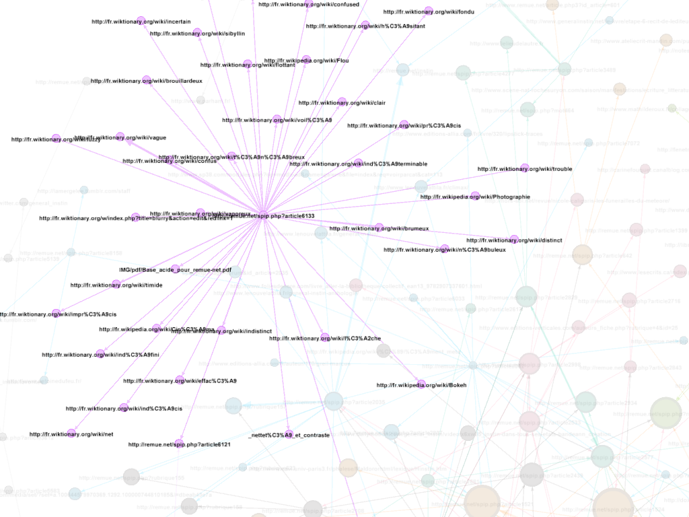
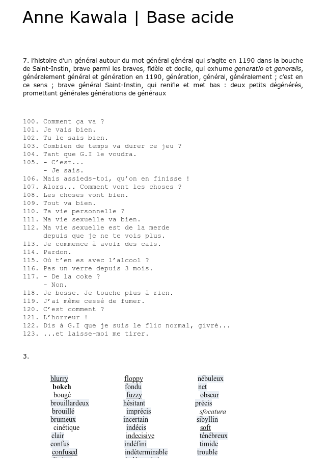

****## Éditorialisation et littérature: le cas du Général Instin
&nbsp;

Enrico Agostini-Marchese, Servanne Monjour,  
Nicolas Sauret, Marcello Vitali-Rosati

 <!-- .element: class="logo" style="width:30%; background-color:ghostwhite;padding: 5px" -->

CSDH-SCHN 2017 - Congress 2017 @ Toronto  
29-31 mai 2017

<!-- .element: style="font-size:1.4rem" -->

 <!-- .element: class="logo" -->

%%%%%%%%%%%%%%%%%%%%%%%%%%%%%%%%%%%%%%%%%%%%%
<!-- .slide: data-background-image="img/cropped-instin_climax_00.jpg" -->
<!-- .slide: class="hover"-->

### Sommaire

* Problématique générale
* Le cas Instin
* Questions de recherche :
  1. Question littéraire
  2. Question dispositive
  3. Question ontologique
* Conclusion

===

On peut écrire des notes ici.

%%%%%%%%%%%%%%%%%%%%%%%%%%%%%%%%%%%%%%%%%%%%%

<!-- .slide: data-background-image="img/0-ordonnancement_rubrique_105vagues.jpg" data-background-size="contain"--->
<!-- .slide: class="hover"-->

## Problématique générale

* Qu'est-ce que l'écriture à l'époque du numérique
  * écriture et espace
  * écriture et littérature
* Comment se transforment la production, la circulation et la légitimation des contenus?

===
Marcello:
Questions de recherche de la Chaire : qu'est-ce que la litt à l'époque du numérique ?
Comment changent les dispositifs d'écriture (production/ circulation / légitimation)

%%%%%%%%%%%%%%%%%%%%%%%%%%%%%%%%%%%%%%%%%%%%%
<!-- .slide: data-background-image="img/generalinstinVitrail.jpg" -->

## Le cas Instin

§§§§§§§§§§§§§§§§§§§§§§§§§§§§§§§§§§§§§§§§§§§§§
<!-- .slide: data-background-image="img/instinss.jpg" -->

### Qu'est-ce qu'Instin ?

===

Notes de présentation

§§§§§§§§§§§§§§§§§§§§§§§§§§§§§§§§§§§§§§§§§§§§§
<!-- .slide: data-background-image="img/vitrailOriginal.jpg" data-background-size="contain"-->

source image : remue.net/  <!-- .element: class="source" -->
===

Une photographie, prise par Juliette Soubrier en 1997. Il s'agit de la photo d'un vitrail qui orne une tombe, la tombe du Général Hinstin, mort en 1905. Le vitrail s'est oxidé avec le temps et laisse désormais apparaitre cette figure fantomatique.

La même année (1997) Patrick Chatelier, écrivain français, reprend cette photo pour la proposer comme contrainte créative lors d'une soirée de performance au squat artistique de la Grange aux belles.   

§§§§§§§§§§§§§§§§§§§§§§§§§§§§§§§§§§§§§§§§§§§§§
<!-- .slide: data-background-image="img/revueGeste.png" data-background-size="contain"-->

source image : revue-geste.fr/  <!-- .element: class="source" -->
===

Cette photo du Général va inspirer les artistes présents, et marquer le début d'un collectif assez informel, qui donnera lieu à quelques publications papier - et à différents atelier littéraires (+/- formels là aussi).

Entre temps, Hinstin a perdu son "H" qui le faisait personnage historique, pour devenir un matériau narratif, platisque, sémiotique.

§§§§§§§§§§§§§§§§§§§§§§§§§§§§§§§§§§§§§§§§§§§§§
<!-- .slide: data-background-image="img/item-026.png" data-background-size="contain" -->

<!--  -->

source image : remue.net/  <!-- .element: class="source" -->
===

Rapidement, insvestissement de la plateforme Remue.net, qui va jouer un rôle d'agrégateur / centralisateur des productions consacrées à Instin : poèmes, récits, beaucoup d'images, des vidéos et enregistrements (car bcp de lectures et d'ateliers commencent à être archivés).
GI devient donc un hypertexte géant.

§§§§§§§§§§§§§§§§§§§§§§§§§§§§§§§§§§§§§§§§§§§§§
<!-- .slide: data-background-image="img/item-036.png" data-background-size="contain" -->

source image : generalinstin.net/  <!-- .element: class="source" -->

===

Des expériences plus ponctuelles sur d'autres plateformes, en gagnant leur autonomie tout en s'inscrivant dans le projet GI - nous avons nommés "Spin-off" ces expériences.

§§§§§§§§§§§§§§§§§§§§§§§§§§§§§§§§§§§§§§§§§§§§§
<!-- .slide: data-background-image="img/toutesLesImages.png" -->

===

Aspect intermédial très fort, production iconographique importante et foisonnante.
Identité visuelle - notamment autour du vitrail (mais nous avons identifié 3-4- patterns qu'il nous faudra étudier davantage) : memento mori / nature morte / land art.

§§§§§§§§§§§§§§§§§§§§§§§§§§§§§§§§§§§§§§§§§§§§§
<!-- .slide: data-background-image="img/Hinstin-famille.jpg" -->

source image : BNF  <!-- .element: class="source" -->

===

Retour de bâton : le collectif redécouvre que la famille Hinstin (avec son H), a en fait partie liée depuis longtemps avec la littérature et les arts - présent chez Jarry, Kessel.
La BNF dispose même d'un fond d'archive de la famille.
Comme quoi l'Histoire et l'histoire ne sont finalement pas si cloisonnés.

§§§§§§§§§§§§§§§§§§§§§§§§§§§§§§§§§§§§§§§§§§§§§
<!-- .slide: data-background-image="img/corpusFantome.png" -->

===

Bref, nous avons un corpus assez complexe - un corpus fantôme.
= Une des difficultés méthodo quand on travaille sur le comtemporain : un patrimoine mouvant, favorisant des pratiques expérimentales qui sont super, mais qui mettent en péril leur propre pérennité.  

§§§§§§§§§§§§§§§§§§§§§§§§§§§§§§§§§§§§§§§§§§§§§
<!-- .slide: data-background-image="img/sp38.png" -->
<!-- .slide: class="hover"-->

### Méthodologie

1.  Recherche et collecte du corpus
2.  Chaîne d'archivage et d'édition
3.  Exploration des données
4.  Réflexion épistémologique sur le projet

===

Notes de présentation

§§§§§§§§§§§§§§§§§§§§§§§§§§§§§§§§§§§§§§§§§§§§§
<!-- .slide: data-background-image="img/inventaireAtom.png" -->
<!-- .slide: class="hover"-->

### _inventaire.xml_

* Captation + indexation :

  1. Exploration du corpus par propagation hypertextuelle
  2. Captation systématique (en cours)
  3. Ajout de sources antérieures à GI

Actuellement <i class="fa fa-arrow-right"></i> 74 _manifestations_ (dont 90% sources web)

===

§§§§§§§§§§§§§§§§§§§§§§§§§§§§§§§§§§§§§§§§§§§§§
<!-- .slide: data-background-image="img/data-workflow.png" data-background-size="contain" -->

===

on retrouve l'inventaire, les sources et la captation web des sources,
un script vient encoder ces sources en TEI.

choix de la TEI : une approche initialement centrée sur le texte, même si on se rend compte progressivement à quel point les médias sont essentiels dans le paysage que dessine le corpus.

Par ailleurs, le passage d'un format HTML à un autre format fait sens dans cette démarche de production d'une archive, nécessité de distinguer les deux objets, que l'un ne soit pas simplement une copie de l'autre. Et nous reviendrons sur les effets et les refléxions que cette démarche a pu amener en dernière partie.

Le choix reste pertinent dans tous les cas, car la TEI nous donne toute latitude pour intégrer dans chacun des éléments les métadonnées d'archive dont nous avons besoin.

%%%%%%%%%%%%%%%%%%%%%%%%%%%%%%%%%%%%%%%%%%%%%
<!-- .slide: data-background-image="img/oeil.jpg" data-background-size="contain" -->
<!-- .slide: class="hover"-->

## Axes de recherche

1. Question littéraire
2. Question dispositive
3. Question ontologique

%%%%%%%%%%%%%%%%%%%%%%%%%%%%%%%%%%%%%%%%%%%%%
<!-- .slide: data-background-image="img/00-schema1-01floucinetique-2.jpg" data-background-size="contain" -->

## Question littéraire

§§§§§§§§§§§§§§§§§§§§§§§§§§§§§§§§§§§§§§§§§§§§§
<!-- .slide: data-background-image="img/rosecompas_grand.jpg" data-background-size="contain" -->
<!-- .slide: class="hover"-->

### De Hinstin à Instin

* Une contrainte créative
* Un personnage de fiction
* L'Histoire et l'histoire

===

§§§§§§§§§§§§§§§§§§§§§§§§§§§§§§§§§§§§§§§§§§§§§
<!-- .slide: data-background-image="img/editionInstin.jpg" -->

### Un modèle hors-livre

* Occupation des marges
* Dissémination sur plusieurs supports/plateformes
* Investissement de l'espace public

===

Problème éditorial, car GI se conçoit principalement dans un "hors-livre".
Depuis le squat de la Grange aux belles, il s'inscrit relativement à la marge - par "marge" on entend celles, principalement, des institutions littéraires mais encore plus éditoriales. Instin est généré dans :
- atelier d'écriture
- revues littéraires
- revue en ligne (Remue)
- sites web
- réseaux sociaux
Il est disséminé sur plusieurs supports, numériques/non-numériques, sur plusieurs plateformes, via des médias différents. Il occupe l'espace public - en même temps que l'espace public se redéfini lui-même, sous l'impulsion du numérique.

§§§§§§§§§§§§§§§§§§§§§§§§§§§§§§§§§§§§§§§§§§§§§
### Une littérature "brouhaha"

> « Publier » retourne à son sens originel : rendre public, passer de l’expression privée destinée à des correspondants précis à l’expression pour des publics de plus en plus divers.
>
> [C]ette multitude d’espaces publics caractérise le moment contemporain de la littérature, comme la sphère publique de la Littérature caractérisait sa représentation moderne. Si ces espaces publics ont toujours existé, même lorsqu’on les mettait sous silence, jamais ils n’ont été aussi nombreux et visibles […] si bien que le littéraire aujourd’hui apparaît en très grande partie comme une arène conflictuelle composée d’une sphère publique hégémonique reposant sur l’imprimé et d’une multitude d’espaces publics contre-hégémoniques relevant plutôt d’une « littérature-brouhaha » (exposée, performée, in situ, multi-support) avec de très nombreuses circulations entre eux. »
>
> Lionel Ruffel, _Brouhaha, Les Mondes du contemporain_

<!-- .element: style="font-size:1.4rem; text-align:justify" -->

===

Notes de présentation

§§§§§§§§§§§§§§§§§§§§§§§§§§§§§§§§§§§§§§§§§§§§§
<!-- .slide: data-background-image="img/sp38.png" -->

### Gestes de publication

===
On parlera donc de "gestes de publication" pour désigner de un nouveau mode de production de diffusion du littéraire, qui vient travailler nos notions littéraires canoniques héritées de l'imprimé (ou surtout d'un modèle édito assez récent)
- le texte : oralité et performance
- l'auteur : GI commons
- l'oeuvre : forme anthologique

§§§§§§§§§§§§§§§§§§§§§§§§§§§§§§§§§§§§§§§§§§§§§
<!-- .slide: data-background-video="/home/nicolas/Vidéos/extrait-instin.mp4" -->

### Oralité, le retour

source: https://vimeo.com/138619730

<!-- .element: class="source" -->

> citation Zumthor

===

video : 9min + 11min30

oralité et performance
origine de la littérature : Epopée, poésie médievale
poiesis (le _faire_), poésie et poème

§§§§§§§§§§§§§§§§§§§§§§§§§§§§§§§§§§§§§§§§§§§§§
<!-- .slide: data-background-image="img/campagneNonOfficielle.png" -->
<!-- .slide: class="hover"-->

### Du libre-accès au libre-service : les "GI Commons"

> Il n’y a pas de chef, pas d’organisation, c’est un fonctionnement particulier. Il n’y a jamais eu non plus de comité de rédaction. Ni de réunion. Une tentative de séminaire a capoté. Il y a des opportunités et des gens qui vont s’investir, longtemps ou pas, dans cette entité.
>
> Patrick Chatelier  

<!-- .element: style="font-size:1.4rem; text-align:justify" -->

===

Autorité ? le concept d’autorité en prend pour son grade. Pas besoin de demander l’autorisation pour utiliser Instin – entité en libre-service autant qu’en libre-accès. N’importe qui peut se l’approprier – comme sujet de l’écriture, comme personnage à mettre en scène, comme signature aussi. 200 personnes se sont agrégées à ce projet au fil des vingt dernières années. on pourrait parler de contributeurs plutôt que d'auteurs, d'ailleurs venus de multiples horizons (littérature, poésie, performance, arts visuels...). De l’aveu même de Chatelier, « Il est impossible de vraiment répondre à la question : Qui – ou plutôt, qu’est-ce que le Général Instin ? ».

§§§§§§§§§§§§§§§§§§§§§§§§§§§§§§§§§§§§§§§§§§§§§
<!-- .slide: data-background-image="img/CV-GI-def.jpg" -->
<!-- .slide: class="hover"-->

### GI, une anthologie

* Un collectif
* Une figure auctoriale
* Un "retour" au modèle imprimé?

===

Instin opère un retour fracassant dans l’univers du livre imprimé sous la forme d’une anthologie : mosaïque de texte, collection de fragments, collectif d’écrivains, l’anthologie GI est la forme par excellence de la littérature-brouhaha.

§§§§§§§§§§§§§§§§§§§§§§§§§§§§§§§§§§§§§§§§§§§§§
<!-- .slide: class="hover"-->

### Culture numérique, culture anthologique

> «Comment expliquer le fait que l’anthologie soit la forme et le format par excellence de la civilisation numérique ? Les recueils de « fleurs » (anthos en grec veut dire « fleur »), censés tenir lieu d’une totalité difficilement accessible dans son intégralité, se sont généralisés, pour représenter non plus un choix ou une sélection dictés par des contraintes matérielles, mais plutôt des fragments conçus et formés pour la circulation et la transmission dans un environnement qui valorise une nouvelle manière de lire et d’écrire. Le fragment, ou toute pièce, tout document de n’importe quelle nature, est citable, mais surtout il se livre à des formes d’intégration dans des outils d’écriture qui sont presque toujours aujourd’hui des outils d’échange et de partage. Cette tournure anthologique, qui s’accentue avec les derniers outils et se confirme avec les nouvelles pratiques, implique une transformation déterminante de nos rapports avec les objets culturels de tous les genres et le savoir tout court. »
>
> Milad Doueihi, _Pour un humanisme numérique_, Seuil, 2011

<!-- .element: style="font-size:1.4rem; text-align:justify" -->

===
L’anthologie, c’est aussi une forme éditoriale ancienne dans notre histoire littéraire et qui, pourtant, serait « la forme et le format par excellence de la civilisation numérique » selon Milad Doueihi.

%%%%%%%%%%%%%%%%%%%%%%%%%%%%%%%%%%%%%%%%%%%%%
<!-- .slide: data-background-image="./img/mashupInstin.png" -->

## Question dispositive

===

Le cas Instin est particulièrement intéressant pour essayer de comprendre ce que devient le dispositif dans l'environnement numérique.

La notion de dispositif a toujours été problématique, elle fait partie de ces termes indéfinissables, insaisissables que tout le monde manipule malgré tout (et je pense avec raison).

§§§§§§§§§§§§§§§§§§§§§§§§§§§§§§§§§§§§§§§§§§§§§

Pour Foucault :

>  «Ce que j'essaie de repérer sous ce nom c'est, [...] un ensemble résolument hétérogène comportant des discours, des institutions, des aménagements architecturaux, des décisions réglementaires, des lois, des mesures administratives, des énoncés scientifiques, des propositions philosophiques, morales, philanthropiques ; bref, du dit aussi bien que du non-dit, voilà les éléments du dispositif.
>
> Le dispositif lui-même c'est le réseau qu'on établit entre ces éléments [...].
>
> C'est ça le dispositif : des stratégies de rapports de force supportant des types de savoir, et supportés par eux»
>
> Foucault, _Dits et écrits_, volume III, p.299 _sq_ (1977)

<!-- .element: style="font-size:1.4rem; text-align:justify" -->

===
Pour Foucault, c'est "un ensemble hétérogène", un "réseau", une "stratégie de rapport de force".

§§§§§§§§§§§§§§§§§§§§§§§§§§§§§§§§§§§§§§§§§§§§§

Pour Agamben :

> «Tout ce qui a, d'une manière ou d'une autre, la capacité de capturer, d'orienter, de déterminer, d'intercepter, de modeler, de contrôler et d'assurer les gestes, les conduites, les opinions et les discours des êtres vivants.»
>
> Agamben, _Qu'est-ce qu'un dispositif ?_ 2007

<!-- .element: style="font-size:1.4rem; text-align:justify" -->

===
Agamben fait une Partition générale et massive de l'être entre :

1. les êtres vivants (ou les substances) : l'ontologie des créatures
2. les dispositifs, à l'intérieur desquels les êtres ne cessent d'être _saisis_.

[Citation Agamben]

Mais la compréhension générale que l'on a du terme se complique lorsqu'on tente de l'amener sur le terrain numérique, où les relations de pouvoir et d'autorité sont profondément remaniées.

Le dispositif revêt notamment un caractère déterministe, en particulier chez Foucault, qui doit être questionné, et c'est notamment à cela que la notion d'éditorialisation nous est utile, comme nous le montrera Marcello.

§§§§§§§§§§§§§§§§§§§§§§§§§§§§§§§§§§§§§§§§§§§§§

<!-- .slide: data-background-image="img/rubon622.jpg" -->

### Dispositif GI ?

===

Ainsi la première question que l'on s'est posé  : quel est le dispositif Instin ? Quel est l'agencement des forces et des autorités qui ont engendré son écriture.

Qui écrit ? où ? mais aussi comment écrit-on Instin ? Y a t il des motifs récurrents et si oui, d'où viennent-ils ? cad aussi, qu'est ce qui _prédispose_ l'écriture du GI ?

Première intuition: il n'y a pas de dispositif : Les méta-discours qui accompagnent les différents fragments d'instin insistent sur le fait qu'instin est un projet sans forme, sans autorité, que tout à chacun peut s'approprier le général, produire un texte, commettre une performance, etc.

Cette intuition est aussi renforcée par l'élongation dans le temps du projet, le fait que les textes et les formes semblent s'accumuler sans poursuivre un objectif précis, si ce n'est celui de produire, aussi celui de faire collectif, celui d'une rhétorique (rhétorique dispositive).

§§§§§§§§§§§§§§§§§§§§§§§§§§§§§§§§§§§§§§§§§§§§§
<!-- .slide: data-background-image="img/vitrailOriginal.jpg"   data-background-size="contain"  -->

===

Productions touffue, oeuvre indéfinissable, collectif multi-forme, ou plutôt à géométrie variable : produit un sentiment d'insaisissabilité du projet et de l'oeuvre, similaire au sentiment face à cette photo du vitrail : une figure insaisissable, aux contours flous, même la direction du regard s'est perdue.

[Vitrail]

Enfin, c'est l'effacement des auteurs, derrière la figure du général, tout à la fois sujet, narrateur, auteur, dans le glissement auctoriale que Servanne a mentionné.

Toutes ces raisons laissent penser que le dispositif est absent.

C'est cette absence supposée de dispositif qui permet justement de poser en creux la question du dispositif, et de se demander ce qu'il devient dans un tel projet, comment il opère, et s'il n'est plus là, qu'est ce qui le remplace.
Autrement dit, de même qu'Instin constitue intuitivement un cas d'étude idéal de littérature contemporaine, il pourrait nous éclairer sur la nature d'un environnement-dispositif, c'est à dire sur une forme de dispositif ouvert à toute forme d'appropriation de lui-même.

§§§§§§§§§§§§§§§§§§§§§§§§§§§§§§§§§§§§§§§§§§§§§
<!-- .slide: data-background-image="./img/Composition3Graphes.png" data-background-size="contain" -->
<!--  .slide: class="hover"-->

* un ensemble ouvert et dynamique, mais fini
* centralité de certains acteurs et plateformes
* deux structures classiques :
  1. organisation arborescente
  2. organisation rhizomatique

===

En fait, ce que nous a montré nos premiers pas dans la constitution de l'archive GI, c'est qu'il existe malgré tout des noeuds de cristallisation, des acteurs à la centralité plus ou moins prégnante, des formes, elles-mêmes investies de leur dispositif.

L'archivage en cours de GI nous amène finalement à cerner le corpus en un ensemble fini. Avec un nombre d’auteurs, de contributions, de plateformes maîtrisables. Elle nous montre par ailleurs que c'est un corpus organisé et distribué dans des rubriques identifiées.

Il y a là deux organisations qui se font face : celle arborescente des plateformes (voir les rubriques de Remue.net), et celle rhizomatique des textes hyperliées.

Ici, nos premiers pas dans la fouille de données : extraire tous les liens contenus dans le corps de texte du corpus et à produire une matrice d'adjacence à partir de ces liens. Cela nous donne un réseau de documents que nous avons pu spatialiser.

§§§§§§§§§§§§§§§§§§§§§§§§§§§§§§§§§§§§§§§§§§§§§

 <!-- .element: width="60%" -->

_Forced-based spatialisation (Fruchterman Reingold)_  <!-- .element: style="font-size: 1.4rem" -->

===
Une première spatialisation (Fruchterman Reingold)

utilisé pour ces premières exploration pour garder un visualisation relativement neutre, révélant des relations sans trop les caractériser : nous permet de garder un lien particulier avec les sources et poursuivre une lecture rapprochée :

réseau de documents, nous montre très clairement que le corpus s'agence et se partitionne

§§§§§§§§§§§§§§§§§§§§§§§§§§§§§§§§§§§§§§§§§§§§§

 <!-- .element: width="60%" -->

Centralité de vecteur propre  <!-- .element: style="font-size: 1.4rem" -->

===
Ainsi, un calcul de centralité vient confirmer qu'il existe dans ce corpus des hubs, des textes plus importants que les autres, davantage cités que les autres, ...

(centralité de vecteur propre (eigen vector))

§§§§§§§§§§§§§§§§§§§§§§§§§§§§§§§§§§§§§§§§§§§§§

 <!-- .element: width="50%" -->
 <!-- .element: width="40%" -->

_La campagne d’Égypte_, Patrice Chatelier (2006)  

<!-- .element: style="font-size: 1.4rem" -->

===
comme c'est le cas de La Campagne d'Egypte de Patrice Chatelier, un des premiers textes du GI sur remue.net.

peut-être biaisé par le fait que notre première approche pour la collection du corpus (pour les 30 premiers items) a été de procéder par propagation à partir des liens hypertextes, et que donc nécessairement, les premiers items collectés sont particulièrement connectés entre eux.

§§§§§§§§§§§§§§§§§§§§§§§§§§§§§§§§§§§§§§§§§§§§§

 <!-- .element: width="60%" -->

Modularité  <!-- .element: style="font-size: 1.4rem" -->

===
le calcul de modularité nous donne une partition en une dizaine de "communautés", ce qu'on n'interprétera pas à ce stade à cause d'un corpus incomplet, mais cela vient ...

§§§§§§§§§§§§§§§§§§§§§§§§§§§§§§§§§§§§§§§§§§§§§

 <!-- .element: width="55%" -->
 <!-- .element: width="40%" -->

_Base acide_, Anne Kawala (2013)  

<!-- .element: style="font-size: 1.4rem" -->

===
... aussi réveler **des formes d'écritures**, comme ce texte dont une trentaine de termes sont associés à une notice de wiktionnary.

§§§§§§§§§§§§§§§§§§§§§§§§§§§§§§§§§§§§§§§§§§§§§

<!-- .slide: data-background-image="img/rubon622.jpg"  -->

### «dispositive» _(adj.)_

===

Et ainsi, ces différentes manifestations produisent ensemble un archipel dont les contours sont finalement relativement identifiables, et dont la fonction peut être qualifiée de dispositive.

Ici, en glissant du concept à l'adjectif, nous abandonnons le _dispositif_, mais sans en abandonner la fonction. C'est l'idée qu'a introduit Louise Merzeau à travers ses écrits lorsqu'elle parle d'_action dispositive_, c'est-à-dire d'une action à la fois opérée dans la cadre d'un dispositif mais aussi contributive et constitutive du dispositif.
Ainsi, il n’y a pas de dispositif formel Général Instin, mais Instin produit un environnement _dispositif_ dans lequel les actions sont des _écritures dispositives_.

Ce glissement n'est pas anodin, il permet de se rapprocher de la nature du dispositif Instin, en tant que média, ou en tant que milieu, mais il fait également le pont avec la notion d'éditorialisation, et comment la nature environnementale du numérique travaille les dispositifs littéraires, tant du côté de l'écriture que de la lecture.

§§§§§§§§§§§§§§§§§§§§§§§§§§§§§§§§§§§§§§§§§§§§§
<!-- .slide: data-background-image="img/textopoly3.jpg" data-background-size="cover" -->

### GI, un rhizome ?

===

Reste à caractériser ce milieu dispositif qu'est Instin, à en identifier les dynamiques d'autorité et les modalités de ce milieu.

Est-ce un rizhome ?

pour lancer Enrico

§§§§§§§§§§§§§§§§§§§§§§§§§§§§§§§§§§§§§§§§§§§§§
<!-- .slide: data-background-image="img/rhizome.jpg" -->
<!-- .slide: class="hover"-->

### Rhizome selon Deleuze et Guattari

* Connexion
* Hétérogénéité
* Multiplicité
* Rupture asignifiante
* Cartographie
* Décalcomanie

§§§§§§§§§§§§§§§§§§§§§§§§§§§§§§§§§§§§§§§§§§§§§
<!-- .slide: data-background-image="img/machine_guerre.jpg" data-background-size="cover" -->
<!-- .slide: class="hover"-->

### Machine de guerre

* Question littéraire :
  * La photo comme pivot
  * La pluralité des formes d’écriture (_Littérature brouhaha_)
* Question numérique :
  * Internet, et le numérique, ne sont pas que réseau

===

Enrico est lancé
Enrico lance Marcello sur l'éditorialisation

§§§§§§§§§§§§§§§§§§§§§§§§§§§§§§§§§§§§§§§§§§§§§
<!-- .slide: data-background-image="./img/mashupInstin.png" -->
<!-- .slide: class="hover"-->

### La notion d'éditorialisation

* **2004-2007: apparition du mot**
  * Une sorte d'édition dans l'environnement numérique
  * Bachimont : passage d'un document non-numérique à un document numérique

* **2008: le terme s'institutionnalise**
  * Sens public: formes de production et de circulation de la connaissance en environnement numérique
  * Laboratoire MSH: Pratiques interdisciplinaires et circulation du savoir : vers une éditorialisation des SHS (Wormser, Vitali-Rosati)

===
(marcello est lancé)
éditorialisation: penser un processus ouvert où auteurs, collectivités, plateformes, dynamiques pratiques sont mêlées et difficiles à retracer. pas curation, pas édition... éditorialisation
poutant ça produit une émergence de sens

§§§§§§§§§§§§§§§§§§§§§§§§§§§§§§§§§§§§§§§§§§§§§
<!-- .slide: data-background-image="./img/mashupInstin.png" -->
<!-- .slide: class="hover"-->

### La notion d'éditorialisation

>«L'éditorialisation désigne l'ensemble des dynamiques qui produisent et structurent l'espace numérique. Ces dynamiques sont les interactions des actions individuelles et collectives avec un environnement numérique particulier.»
>
> Vitali-Rosati, _Qu'est-ce que l'éditorialisation?_, Sens public 2016

<!-- .element: style="font-size:1.6rem; text-align:justify" -->

===

§§§§§§§§§§§§§§§§§§§§§§§§§§§§§§§§§§§§§§§§§§§§§
<!-- .slide: data-background-image="./img/mashupInstin.png" -->
<!-- .slide: class="hover"-->

### Caractéristiques de l'éditorialisation

- ouverte
  - plusieurs plateformes
  - plusieurs acteurs
  - toujours inachevée
- processuelle
- collective

===
(différence avec la curation de contenus)

§§§§§§§§§§§§§§§§§§§§§§§§§§§§§§§§§§§§§§§§§§§§§
<!-- .slide: data-background-image="img/10458166_10153074634228797_4994304635406227180_n.jpg" -->
<!-- .slide: class="hover"-->

### L'espace

- Espace mathématique et espace social
- L'espace porte des valeurs - le nomos de Schmitt (cf. Agostini-Marchese)

===

On a dit que l'édito produit l'espace: mais qu'est-ce que l'espace?

§§§§§§§§§§§§§§§§§§§§§§§§§§§§§§§§§§§§§§§§§§§§§
<!-- .slide: data-background-image="img/panInstin.png" -->
<!-- .slide: class="hover"-->

## Espace numérique

  1. un espace architectural
  - un espace réel
  - un espace hybride
  - un espace en mouvement

===

Notes

§§§§§§§§§§§§§§§§§§§§§§§§§§§§§§§§§§§§§§§§§§§§§
<!-- .slide: data-background-image="img/instinDoeuvre.png" -->
<!-- .slide: class="hover"-->

## Espace et _nomos_

- Milieu
- Technique/technologie
- Instances de l’autorité
- Le symbolique et l’imaginaire

===

Enrico doit faire le lien vers la question ontologique

%%%%%%%%%%%%%%%%%%%%%%%%%%%%%%%%%%%%%%%%%%%%%
<!-- .slide: data-background-image="img/reveGeneral.png" -->

## Question ontologique

§§§§§§§§§§§§§§§§§§§§§§§§§§§§§§§§§§§§§§§§§§§§§
<!-- .slide: data-background-image="img/StLouisNavire.JPEG" -->

### Origine(s)

===

frontières : quand GI commence ??
  la photo ? chatelier ? les premières manifestations littéraires sur **H**-instin, ou toute inscription du nom Hinstin : l'acte de naissance d'Hinstin , l'acte de décès (il produit le vitrail),
  voir à la BNF : un fond photographique dédié à la famille Hinstin (+ navire de guerre), en lien avec Lautréamont (alias Isidore Ducasse)

on ne répond pas à la question

§§§§§§§§§§§§§§§§§§§§§§§§§§§§§§§§§§§§§§§§§§§§§

<iframe data-src='https://cdn.knightlab.com/libs/timeline3/latest/embed/index.html?source=18rhwdJjrIvOahi_L70BqDT9x8_EKqmxgsPQk7AFtnog&font=Default&start_at_slide=19&lang=fr&initial_zoom=21&height=650' width='100%' height='650' webkitallowfullscreen mozallowfullscreen allowfullscreen frameborder='0'></iframe>

===

présentation de la timeline
timeline encore une tentative,
catégorisation : celles des sites..

objectifs : proposer d'autres catégorisations

mais aussi d'autres formes de visualisation

à partir de la Timeline, constat :
  * on a observé que les frontières* n'étaient pas si évidentes : frontières temporelles et spatiales de l'objet

§§§§§§§§§§§§§§§§§§§§§§§§§§§§§§§§§§§§§§§§§§§§§
<!-- .slide: data-background-image="img/instinPapier.png" -->

### Spin-offs

===

des spins-offs (publications papier sous le nom d'Instin):
* Climax : réflexion sur l'archive
* Spoon River : côté anthologique qui revient

§§§§§§§§§§§§§§§§§§§§§§§§§§§§§§§§§§§§§§§§§§§§§
<!-- .slide: data-background-image="img/adamique.png" -->

===
Lire le texte.

§§§§§§§§§§§§§§§§§§§§§§§§§§§§§§§§§§§§§§§§§§§§§
<!-- .slide: data-background-image="img/arton2702.jpg" data-background-size="contain"-->

### Histoire et mémoire collective

===

confrontation entre l'objet littéraire et l'objet historique (l'histoire est de toutes les façons en construction, pas en opposition avec la fiction)

Chronologie linéaire :

du réel au récit : le point d'origine
  la photographie du vitrail VS la chronologie de "vrai" général

et comment l'un façonne l'autre.

§§§§§§§§§§§§§§§§§§§§§§§§§§§§§§§§§§§§§§§§§§§§§
<!-- .slide: data-background-image="img/vitrailOriginal.jpg"-->
<!-- .slide: class="hover"-->

### Pourquoi le GI ?

Qu'est ce qui a permis à GI de fonctionner ?

===

L'intuition qu'Instin est davantage qu'un terrain de jeu : il semble pouvoir révéler quelque chose de notre mémoire collective, de notre identité.
la question de l'histoire, de l'origine

La symbolique du général

les ingrédients du mème

§§§§§§§§§§§§§§§§§§§§§§§§§§§§§§§§§§§§§§§§§§§§§
<!-- .slide: data-background-image="img/errants.png"-->

===

Lire le texte

§§§§§§§§§§§§§§§§§§§§§§§§§§§§§§§§§§§§§§§§§§§§§
<!-- .slide: data-background-image="img/G.I.-15h26--.jpg" data-background-size="contain"-->
<!-- .slide: class="hover"-->

### Imaginaire/réel

* espace numérique et brouillage des frontières
* fusion entre texte, paratexte et épitexte
* superposition de discours littéraire et non littéraire

===

Statut ontologique de la littérature
Espace
P. Valéry

§§§§§§§§§§§§§§§§§§§§§§§§§§§§§§§§§§§§§§§§§§§§§
<!-- .slide: data-background-image="img/projet.png"-->

===

Lire le texte.

%%%%%%%%%%%%%%%%%%%%%%%%%%%%%%%%%%%%%%%%%%%%%
<!-- .slide: data-background-image="img/archive.png" -->
## Archiver Instin

===

éditorialisation de l'archive et conséquence ontologique

La question du statut des manifestations :
  * entre l'origine historique
  * les premières manifestations littéraires
  * les origines du projet GI
  * les documentations de performance ou d'ateliers
  * les visuels des graphes : où se place l'écriture ? qu'est ce qui participe à Instin : l'acte de peindre dans la rue, la captation photographique, la publication de la photographie sur un blog ?

tentative vaine de totalisation

Archivage : processus de légitimation d'une littérature hors institution, ce que Bridget Christine Moynihan appellait le "prismatic fringes", les espaces marginaux.
  question : comment l'archive, et plus spécifiquement l'édition numérique de l'archive peut modifier du statut de ces oeuvres. Comment la mise en archive travaille l'objet source.

Instin : occupation volontaire des marges: qu'est ce que veut dire l'archivage des marges.

Problématique d'étude littéraire : la perte chez les surréalistes

§§§§§§§§§§§§§§§§§§§§§§§§§§§§§§§§§§§§§§§§§§§§§

> «&nbsp;Depuis quelques années [le terme "littérature"] tend à se dissiper comme objet de connaissance, voire simplement de perception. Simultanément, le statut de l’«&nbsp;histoire de la littérature&nbsp;» est remis en question. De telles incertitudes ne sont pas propres à notre époque ; elles s’associent aux regrets qu’inspire périodiquement depuis trois siècles une prétendue décadence de la culture livresque : constante paradoxale, où l’on pourrait discerner les accès récurrents d’une nostalgie de la voix vive. Mais la logique discursive qui constitua notre « littérature » fonctionne aujourd’hui de pis en pis ; une menace d’aliénation connote plus ou moins tous les sens produits par elle. Preuve en soit la fortune dont jouit pendant une vingtaine d’années la «&nbsp;théorie littéraire&nbsp;» : compensation — peut-être honteuse — d’une perte de foi en la validité des littératures.»
>
> Paul Zumthor, _La Voix et la lettre_

<!-- .element: style="font-size:1.6rem; text-align:justify" -->

§§§§§§§§§§§§§§§§§§§§§§§§§§§§§§§§§§§§§§§§§§§§§
<!-- .slide: data-background-image="img/archive.png" -->
<!-- .slide: class="hover"-->

## Editorialisation de l'archive

* double dynamique :
  * ouverture et continuité : rendre l'archive publique et appropriable
  * réflexivité : que nous dit le design de l'archive sur le dispositif GI lui-même

===
C’est en quelque sorte une première étape d’éditorialisation d’une archive et ce processus d’éditorialisation nous projette dans une double dynamique :

    dynamique d’ouverture : dans la continuité de l’esprit du Général Instin, cette éditorialisation pourrait avoir vocation à devenir publique, accessible, appropriable.
    dynamique réflexive sur notre projet : en faisant le pari que la conception du dispositif d’éditorialisation de l’archive nous éclairera sur le dispositif GI lui-même.

Ce pari est celui d’un dialogue entre le dispositif de publication littéraire du GI et le dispositif d’une archive scientifique. Un dialogue tout en tension, tout en contradiction peut-être, mais dont la démarche fait sens pour considérer l’archive non pas comme une tentative de totalisation de GI, mais plutôt de projection en miroir, elle-même excroissance du projet.

%%%%%%%%%%%%%%%%%%%%%%%%%%%%%%%%%%%%%%%%%%%%%
<!-- .slide: data-background-image="img/iLoveInstin.jpg" data-background-size="contain" -->
<!-- .slide: class="hover"-->

### Merci !

à suivre sur [nicolassauret.net/behindinstin](http://nicolassauret.net/behindinstin)

 <!-- .element: class="logo" style="width:30%; background-color:ghostwhite;padding: 5px" -->

CSDH-SCHN 2017 - Congress 2017 @ Toronto  
29-31 mai 2017

<!-- .element: style="font-size:1.4rem" -->

 <!-- .element: class="logo" -->
